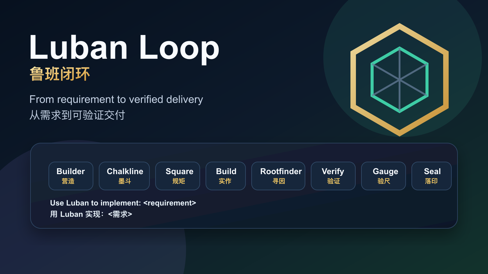
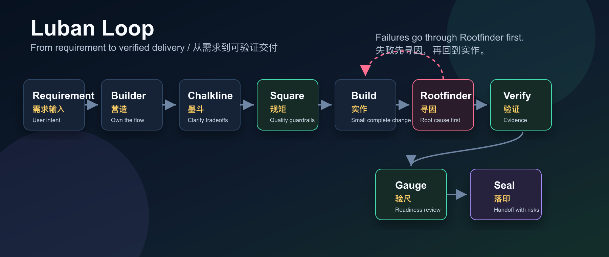

# Luban Loop

**Luban Loop** is a bilingual engineering delivery workflow for AI coding agents. It turns a plain requirement into implementation, verification, review, and a final handoff with evidence.

**鲁班闭环** 是一个面向 AI 编程 Agent 的工程交付 workflow：从需求描述出发，推进到实现、验证、评审和带证据的交付说明。



## Use It

```text
Use Luban to implement: <requirement>
用 Luban 实现：<需求>
```

Other common prompts:

```text
Use Luban to fix: <bug or broken behavior>
用 Luban 修复：<问题>

Use Luban to analyze: <decision or proposal>
用 Luban 分析：<方向或方案>

Use Luban to review: <current changes>
用 Luban 检查：<当前改动>
```

## Workflow



```text
Requirement / 需求输入
  -> Builder / 营造
  -> Chalkline / 墨斗
  -> Square / 规矩
  -> Build / 实作
  -> Rootfinder / 寻因
  -> Verify / 验证
  -> Gauge / 验尺
  -> Seal / 落印
```

## Roles

| Role | Chinese | Responsibility |
| --- | --- | --- |
| Builder | 营造 | Owns the goal, project context, implementation flow, and verification selection. |
| Chalkline | 墨斗 | Clarifies requirements, decisions, boundaries, and tradeoffs. |
| Square | 规矩 | Keeps implementation simple, disciplined, scoped, and verifiable. |
| Build | 实作 | Makes the smallest complete change that fits the existing project. |
| Rootfinder | 寻因 | Diagnoses root causes before fixing failures or unexpected behavior. |
| Verify | 验证 | Runs tests, QA, browser/runtime checks, and collects evidence. |
| Gauge | 验尺 | Reviews the diff, risks, gaps, quality guardrails, and readiness. |
| Seal | 落印 | Outputs delivery notes, verification evidence, non-scope, and remaining risks. |

## What It Solves

Most agent workflows fail in one of four places:

- They start coding before the requirement is decision-complete.
- They over-design small tasks and add unnecessary abstractions.
- They fix symptoms without finding the root cause.
- They claim completion without reproducible verification evidence.

Luban Loop adds a lightweight structure around those failure points without turning every task into a heavy process.

## Capabilities

Luban bundles the complete Waza capability set plus Square quality guardrails inside one top-level skill:

```text
think, design, check, hunt, write, learn, read, health, square
```

See [Capability Review](docs/capability-review.md) for the full capability map, review findings, verification evidence, and remaining risks.

## Install

One-line install:

```bash
curl -fsSL https://raw.githubusercontent.com/Zanetach/luban-loop/main/scripts/install.sh | bash
```

This downloads the repository archive, then installs one top-level `luban` skill into Agents, Codex, and Claude Code skill locations. If you run `./scripts/install.sh` from a cloned checkout, it installs directly from the local files.

The installer prints terminal status messages for each target path and ends with the user-facing Luban process:

```text
Requirement -> Builder -> Chalkline -> Square -> Build -> Rootfinder -> Verify -> Gauge -> Seal
```

The Waza and Square modules are bundled inside the `luban` directory:

```text
~/.agents/skills/luban
~/.agents/skills/luban/think
~/.agents/skills/luban/design
~/.agents/skills/luban/hunt
~/.agents/skills/luban/check
~/.agents/skills/luban/write
~/.agents/skills/luban/learn
~/.agents/skills/luban/read
~/.agents/skills/luban/health
~/.agents/skills/luban/square

~/.codex/skills/luban
~/.codex/skills/luban/think
~/.codex/skills/luban/design
~/.codex/skills/luban/hunt
~/.codex/skills/luban/check
~/.codex/skills/luban/write
~/.codex/skills/luban/learn
~/.codex/skills/luban/read
~/.codex/skills/luban/health
~/.codex/skills/luban/square

~/.claude/skills/luban
~/.claude/skills/luban/think
~/.claude/skills/luban/design
~/.claude/skills/luban/hunt
~/.claude/skills/luban/check
~/.claude/skills/luban/write
~/.claude/skills/luban/learn
~/.claude/skills/luban/read
~/.claude/skills/luban/health
~/.claude/skills/luban/square
```

If you already cloned the repository, run the local installer:

```bash
./scripts/install.sh
```

The public workflow name is **Luban Loop**. The installed skill name is `luban`.
In Claude Code, this creates the personal skill command `/luban` from `~/.claude/skills/luban/SKILL.md`.

## Verify

```bash
./scripts/verify.sh
```

This validates the bundled skill file and compiles the verification discovery script.

## Repository Layout

```text
skills/luban/SKILL.md                      # Luban Loop skill instructions
skills/luban/scripts/discover_verify.py    # repo-aware verification command discovery
skills/luban/think/                        # internal Chalkline planning module
skills/luban/design/                       # internal Waza design module
skills/luban/hunt/                         # internal Rootfinder debugging module
skills/luban/check/                        # internal Gauge review module
skills/luban/write/                        # internal Waza writing module
skills/luban/learn/                        # internal Waza learning module
skills/luban/read/                         # internal Waza reading module
skills/luban/health/                       # internal Waza health audit module
skills/luban/square/                       # internal Square quality guardrails module
skills/luban/rules/                        # internal Waza shared rules
docs/summary.md                            # external-facing project summary
docs/capability-review.md                  # capability map and review
docs/luban-loop-flow.mmd                   # Mermaid workflow diagram
assets/luban-loop-flow.svg                 # workflow diagram source image
assets/luban-loop-flow.png                 # workflow diagram PNG
assets/luban-loop-card.svg                 # promotional card source image
assets/luban-loop-card.png                 # promotional card PNG
scripts/install.sh                         # one-line and local skill installer
scripts/install-remote.sh                  # compatibility wrapper for the old remote installer URL
scripts/verify.sh                          # local validation script, including install smoke tests
NOTICE.md                                  # upstream attribution
```

## License

MIT
